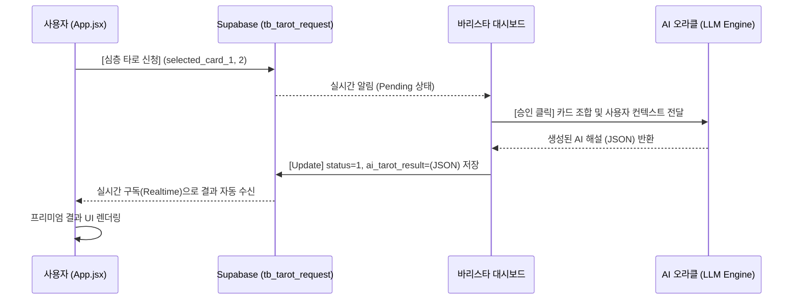

# ☕ 커피라이크 AI 오라클 통합 설계서 (V1.0)

본 문서는 바리스타의 **'승인'** 액션을 트리거로 하여, AI가 카드 2장의 조합을 실시간으로 분석/생성하고 이를 데이터베이스에 기록하여 사용자에게 전달하는 **'시크릿 오라클'** 시스템의 통합 설계를 기술합니다.

---

## 1. 개요 (Overview)

기존 클라이언트 사이드에서 일회성으로 생성되던 AI 해설 로직을 **백엔드(Server-Side) 중심**으로 전환합니다. 
이를 통해 해설의 신뢰성(보안)을 확보하고, 바리스타가 승인한 데이터만 사용자에게 노출되는 안정적인 운영 환경을 구축합니다.

---

## 2. 시스템 아키텍처 (Architecture)

### 2.1 데이터 흐름 (Data Flow)



---

## 3. 상세 설계 (Detailed Design)

### 3.1 AI 해설 생성 로직 (Oracle Logic)

바리스타가 승인 버튼을 누르는 순간, 시스템은 다음의 컨텍스트를 AI(LLM)에 전달합니다.

- **Input 1 (현재의 실타래)**: 사용자가 직접 뽑은 첫 번째 카드 정보.
- **Input 2 (미래의 향기)**: 시스템이 자동 추첨한 두 번째 카드 정보.
- **Tone & Manner**: `Aromatic`, `Professional`, `Mystical`, `Encouraging`. (커피라이크의 브랜드 가치를 담은 톤)

### 3.2 AI 프롬프트 가이드라인 (Prompt Strategy)

> "당신은 커피 전문점 '커피라이크'의 전속 타로 마스터이자 바리스타입니다. 사용자가 뽑은 [카드1]과 [카드2]의 의미를 '커피의 향기와 운명의 흐름'이라는 관점에서 조합하여 최상의 신탁을 제공하십시오."

**결과 JSON 규격 (`ai_tarot_result` 필드)**:
```json
{
  "mainFortune": "오늘의 핵심 운명 메시지 (한 줄 요약)",
  "deepInsight": "두 카드의 조합이 가지는 구체적인 심층 분석 (본문)",
  "caution": "오늘 하루 주의해야 할 점 (조언)",
  "coffeePairing": "오늘의 운명에 어울리는 추천 커피 메뉴"
}
```

---

## 4. DB 스키마 및 API 명세

### 4.1 `public.tb_tarot_request` 테이블 확장
- `ai_tarot_result`: **JSONB** 타입. AI가 생성한 최종 해설 객체를 저장.
- `barista_id`: 승인한 바리스타 식별자 (향후 보상 체계 연동).
- `barista_comment`: (선택) 바리스타가 직접 남기는 한마디.

---

## 5. 구현 단계 (Implementation Milestones)

1. **Step 1 (UI Bridge)**: 바리스타 대시보드 승인 로직에 AI 생성 API 호출부(Mock up) 통합.
2. **Step 2 (LLM Integration)**: OpenAI/Gemini API 연동 및 프롬프트 튜닝.
3. **Step 3 (Realtime Sync)**: 사용자 화면에서 `ai_tarot_result` 필드 변화를 감지하여 즉시 렌더링하도록 `App.jsx` 수정.
4. **Step 4 (Optimization)**: 해설 생성 중 로딩 애니메이션 및 에러 핸들링 고도화.

---

## 6. 기대 효과 (Expected Impact)

- **브랜드 가치 상승**: '바리스타가 직접 승인해주는 AI 신탁'이라는 프리미엄 스토리텔링 강화.
- **운영 안정성**: 클라이언트 코드 변조를 통한 해설 조작 원천 차단.
- **사용자 경험**: 결과 대기 중의 설렘(Anticipation) 극대화 및 고퀄리티 해설 제공.

---
**작성자**: 안본 (AI개발본부장)
**승인자**: 큰형님 (박 사장님)
